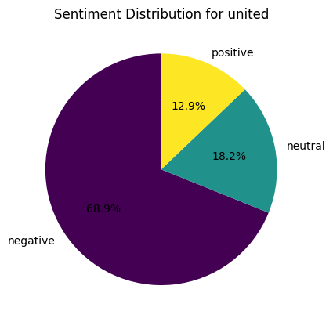
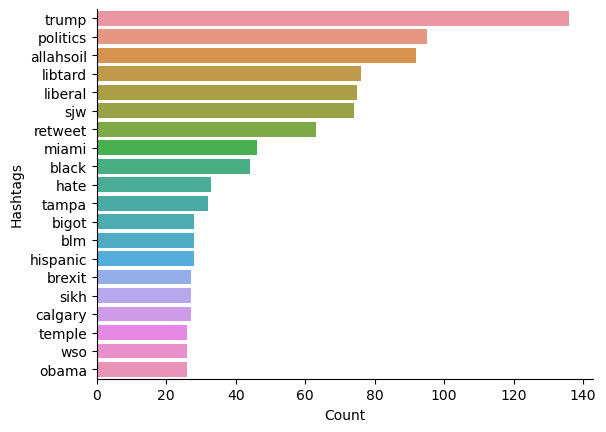
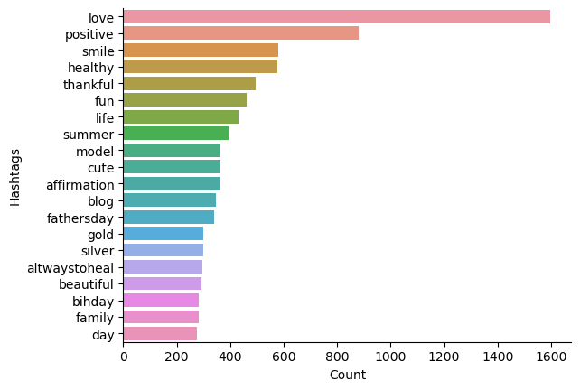
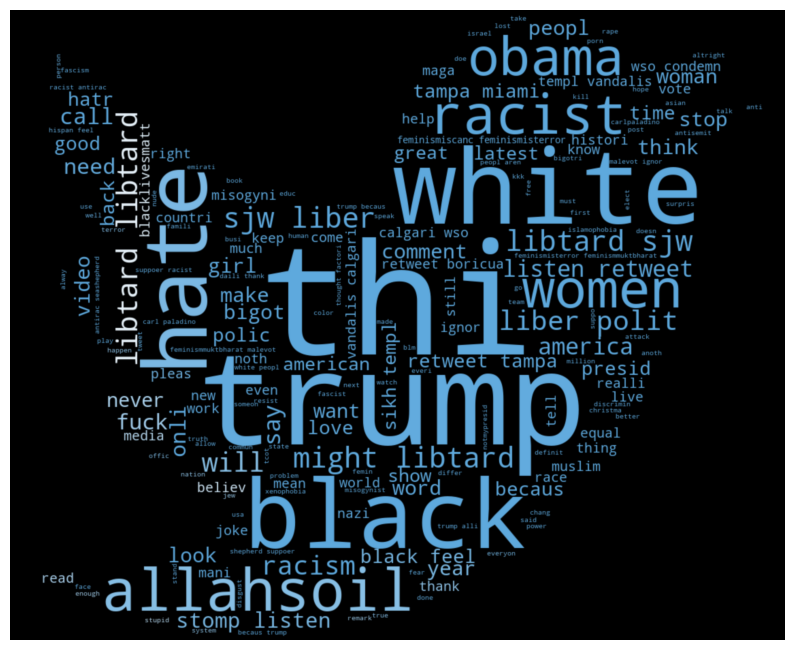
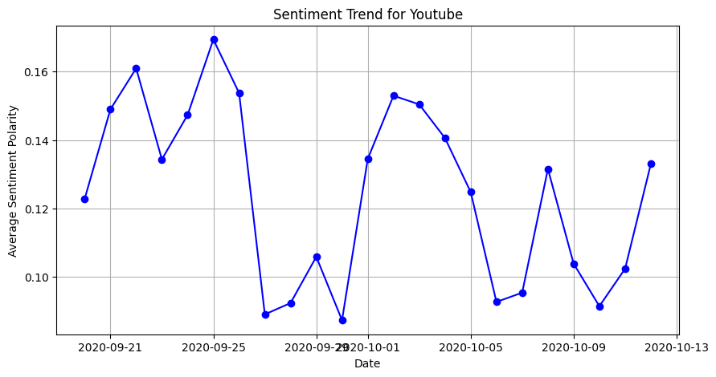

## Sentiment Analysis of Airlines and Big Tech Companies

This repository contains three Jupyter Notebook files aimed at sentiment analysis of airlines companies' sentiment through LinkedIn and Twitter posts, as well as sentiment analysis of big tech companies using Facebook data.

## Files:

1. **Airlines_Sentiment_Analysis.ipynb**
   - This notebook focuses on sentiment analysis of airlines companies using data extracted from LinkedIn and Twitter posts. It employs various natural language processing techniques to analyze the sentiment expressed towards airlines companies in social media.

2. **Twitter_Post_Analysis.ipynb**
   - This notebook specifically analyzes Twitter posts. It utilizes sentiment analysis techniques to understand the sentiment of Twitter.

3. **Sentiment_Analysis_Using_Facebook.ipynb**
   - This notebook delves into sentiment analysis using data extracted from Facebook. It particularly focuses on big tech companies and their public perception based on Facebook posts. 

## Screenshots:

- Screenshots for each notebook file will be provided in the corresponding folders within this repository.

### Screenshots:

1. **Airlines_Sentiment_Analysis**:
   - 
   - 

2. **Twitter_Post_Analysis**:
   - 
   - 
   - 
   - 

3. **Sentiment_Analysis_Using_Facebook**:
   - 
   - 

## Instructions:

1. Clone the repository to your local machine.
2. Open each notebook file using Jupyter Notebook or JupyterLab.
3. Run the cells in the notebooks to execute the code and generate the sentiment analysis results.
4. Refer to the screenshots provided for visual insights into the analysis.
5. Customize the analysis as per your requirements or extend it further.

